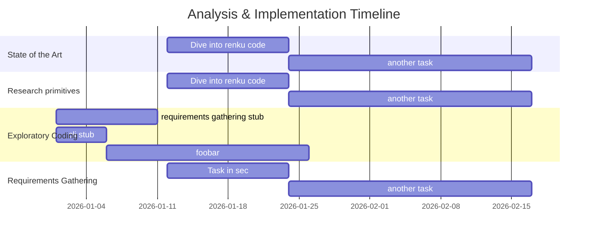
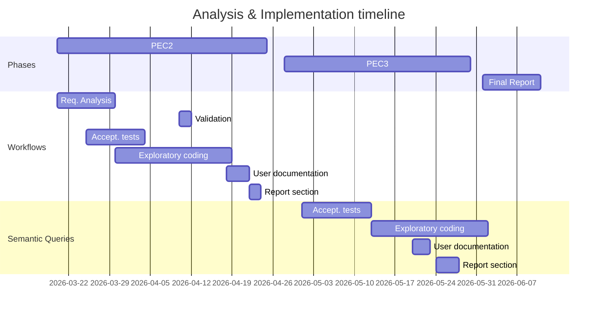

```mermaid
gantt
    title Analysis & Implementation Timeline
    dateFormat  MM-DD

    section State of the Art
    Dive into renku code :01-12  , 12d
    another task         : 24d

    section Research primitives
    Dive into renku code :01-12  , 12d
    another task         : 24d

    section Exploratory Coding
    requirements gathering stub :a1, 01-01, 10d
    cli stub             :a1, 01-01, 5d
    foobar               :after a1  , 20d

    section Requirements Gathering
    Task in sec          :01-12  , 12d
    another task         : 24d
```

```mermaid
gantt
    title Analysis & Implementation timeline
    dateFormat  MM-DD

    section Phases
    PEC2                  :a1, 03-20, 04-25
    PEC3                  :a2, 04-28, 05-30
    Final Report          :a3, 06-01, 10d

    section Workflows
    Req. Analysis         :a5, 03-20, 10d
    Validation            :a6, 04-10, 2d
    Accept. tests         :a7, 03-25, 10d
    Exploratory coding    :after a5, 20d
    User documentation    :a8, 04-18, 4d
    Report section        :a9, 04-22, 2d

    section Semantic Queries
    Accept. tests           :a10, 05-01, 12d
    Exploratory coding      :after a10,  20d
    User documentation      :a11, 05-20, 3d
    Report section          :a12, 05-24, 4d
```

